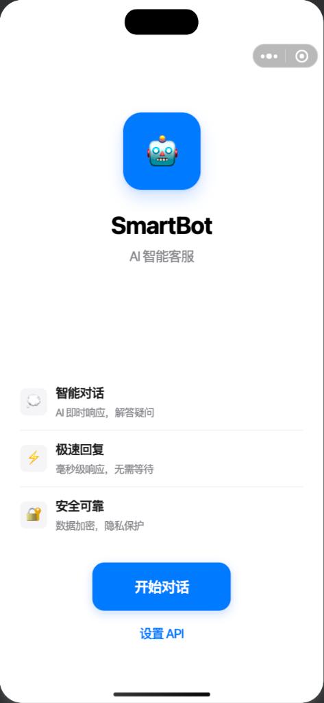
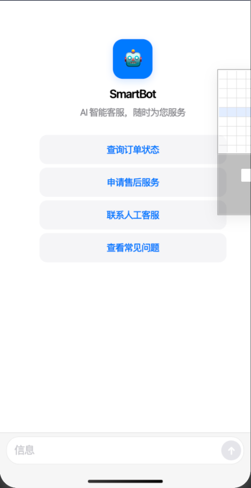
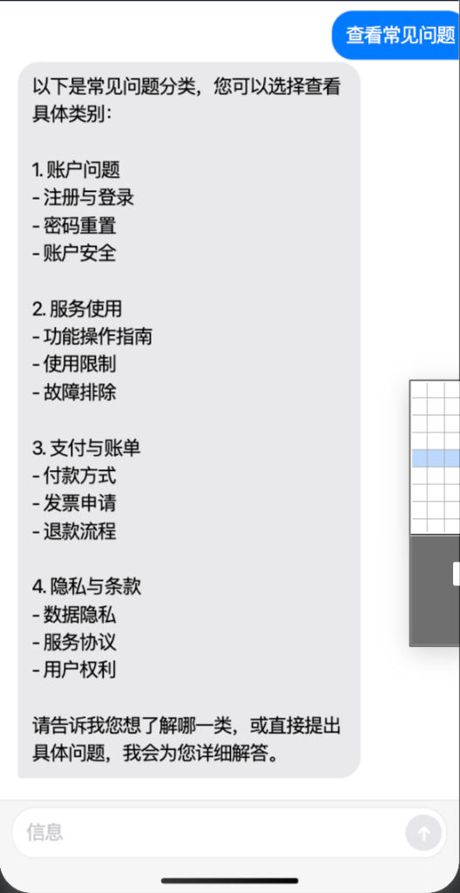
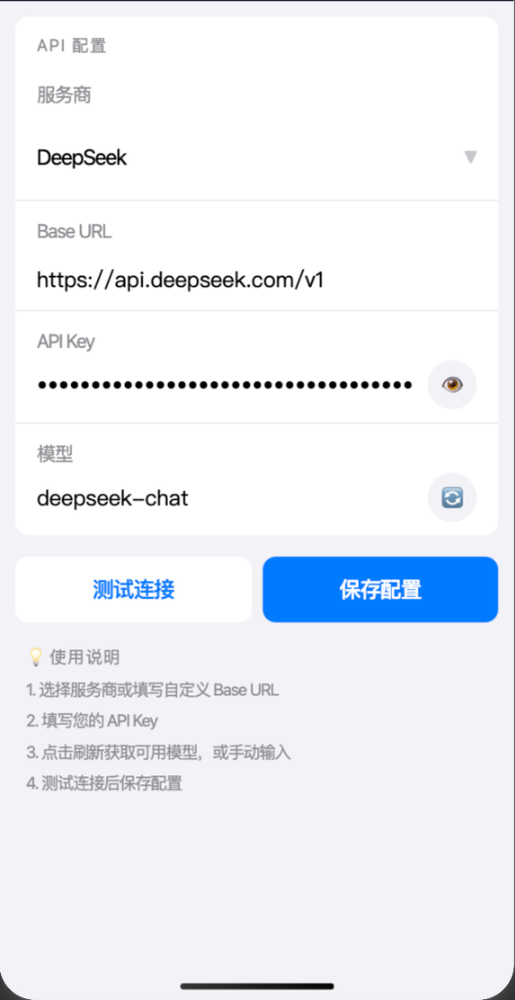

# SmartBot

AI-powered customer service chatbot for WeChat Mini Program. Scan, chat, and get instant AI responses — with a clean iMessage-style interface.

  
  
  
  

## Features

- 🤖 **AI Chat** — Intelligent Q&A powered by large language models (DeepSeek / OpenAI)
- ⚡ **Streaming Output** — Real-time typewriter effect for natural conversation feel
- 🔧 **Multi-Provider** — Switch between DeepSeek, OpenAI, or any custom API endpoint
- 🎨 **Apple Design** — Clean, minimal iMessage-style chat interface
- 📱 **Zero Backend** — Direct API calls from client, no server needed
- 💬 **Quick Prompts** — Pre-configured shortcut questions for common queries

## Screenshots

| Welcome | Chat Entry | AI Reply | Settings |
|:---:|:---:|:---:|:---:|
|  |  |  |  |

## Tech Stack

| Layer | Technology |
|-------|-----------|
| Platform | WeChat Mini Program (Native) |
| AI Integration | DeepSeek / OpenAI API |
| Streaming | SSE (Server-Sent Events) |
| UI Style | Apple iOS Design Language |

## Getting Started

1. Open [WeChat DevTools](https://developers.weixin.qq.com/miniprogram/dev/devtools/download.html)
2. Import this project directory
3. Configure your AI API key in the Settings page
4. Preview or upload to WeChat

## Use Cases

- Customer support automation for small businesses
- AI assistant for WeChat-based services
- Quick-deploy chatbot without backend infrastructure

## License

MIT
